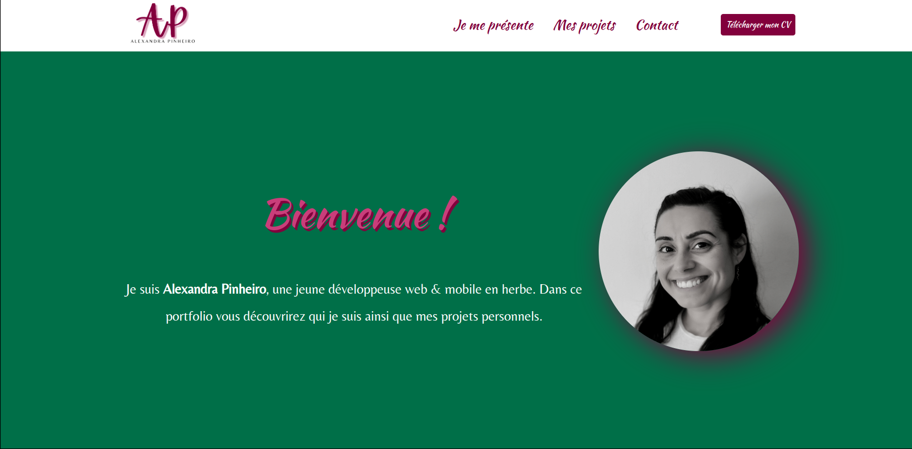
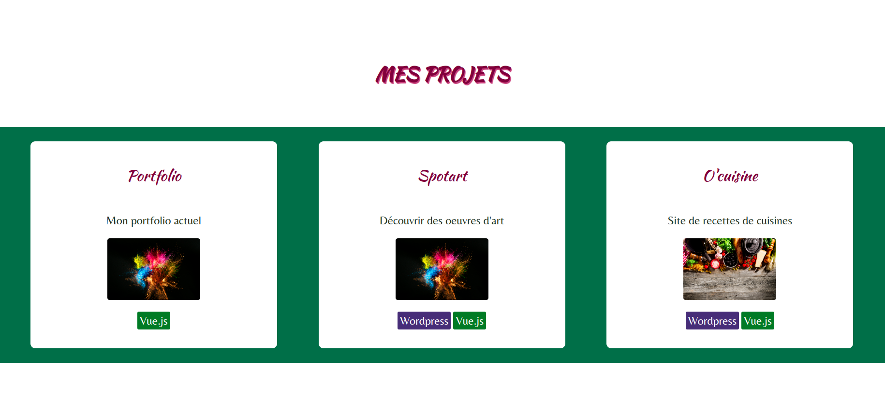
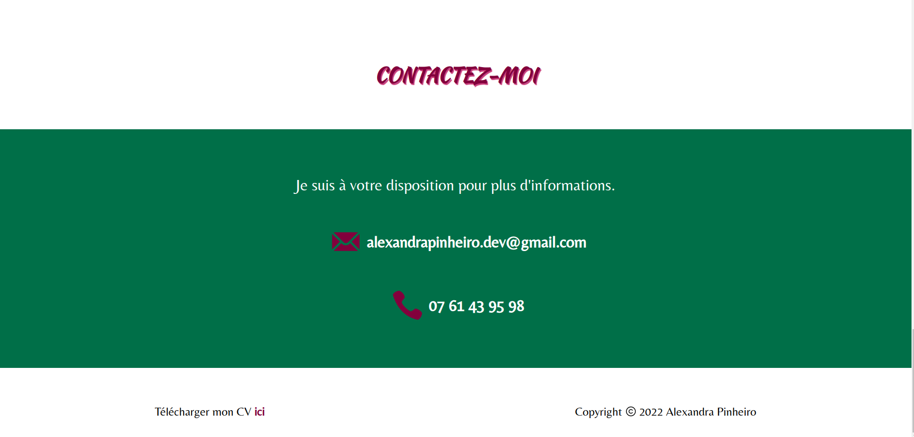

# vue-portfolio
Page d'accueil

Page de présentation

Page projets

Page contact



Mon portfolio a été créé en utilisant 
- Vue.Js 
- Node.Js
- CSS3
- VsCode

### Caractéristiques
```
**📱 Responsive**
**🎨 Create from scratch**


## Project setup
```
npm install
```

### Compiles and hot-reloads for development
```
npm run serve
```

### Compiles and minifies for production
```
npm run build
```

### Lints and fixes files
```
npm run lint
```
